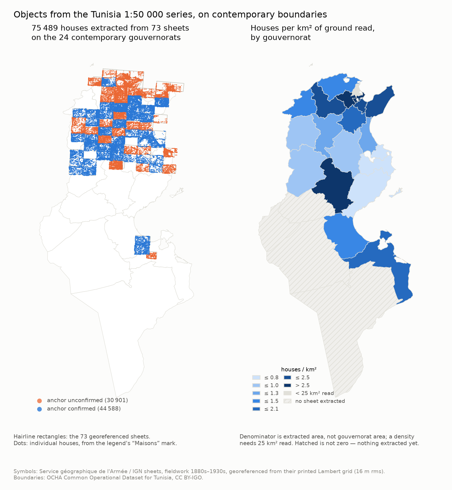

# Extracting objects with coordinates you can trust

Two steps, in this order, because the second is worthless without the first:
give every sheet an exact pixel-to-ground transform, then find the legend's
symbols in the pixels and push them through it.

| Step | Script | Output |
| --- | --- | --- |
| Georeference | [`scripts/georeference_sheets.py`](../scripts/georeference_sheets.py) | `data/sheet_georef.{json,csv}`, `data/georef/*.{wld,points}` |
| Extract symbols | [`scripts/extract_symbols.py`](../scripts/extract_symbols.py) | `data/symbols/<record_id>.geojson`, `data/symbols_summary.csv` |

---

## 1. The transform

### Why neither obvious anchor works alone

The **catalogue bounding box** gives absolute position but its corners are
rounded — to whole arcminutes on 29 of 93 sheets — so it is good to about
±800 m. The **printed kilometric grid** gives scale and rotation to a tenth of a
percent and sits at exact integer kilometres in Lambert, but the detector finds
*where* the lines are, not *which* kilometre each one is.

So the linear part of the transform comes from the grid and the absolute
kilometre comes from the **grid labels printed in the margin**, read by OCR with
their positions and matched back to the detected lines. The catalogue box is
demoted to two jobs: a window that tells the label reader which three-digit
numbers could possibly be Lambert values, and an independent check afterwards.

### What the numbers say

Measured on four sheets read closely (Kairouan, Kasserine, Toujane, Médenine):

| | |
| --- | --- |
| Grid fit residual, RMS | **8–25 m** (median 16 m) |
| Ground metres per pixel | 4.26 m |
| Control points per sheet | ~600 grid intersections |

The residual is the number that matters for relative geometry. A printed grid is
rigid, so a single affine fitting 600 intersections to 16 m RMS means the scale,
rotation and skew are right and the paper is flat. **Distances and shapes within
a sheet are good to about 20 m.**

Absolute position is a separate question and is reported per sheet as
`anchor_vs_catalogue_e_m` / `_n_m` — how far the label-derived anchor sits from
where the catalogue would have put it. On Kasserine that is 231 m and 332 m,
comfortably inside the catalogue's own rounding. Sheets where the labels do not
agree well enough among themselves, or where the result is more than a kilometre
from the catalogue, are marked `anchor_confident = 0` and should not be used for
absolute work until checked by hand.

### Four wrong turns, each recorded in the code

These cost most of the work and each one produced a plausible-looking wrong
answer, which is why they are written down rather than quietly fixed.

1. **The snap statistic measured the wrong thing.** Estimating the absolute
   offset at every grid intersection and rounding to the nearest kilometre
   reported a ~500 m snap distance on every sheet regardless of quality — it was
   measuring the catalogue's *scale* error accumulating over 30 km, not its
   offset. The offset has to be estimated once, at one point.
2. **The neatline is three lines, not one.** Each side of the frame is an inner
   neatline against the map, then the graticule's graduated band, then a heavy
   outer rule. Searching inward from the paper edge finds the outer rule, 130 px
   beyond the neatline, and every sheet measured about 5% too tall; searching
   outward from the map centre overshoots the other way by 2%. Either error is
   ±400 m in the anchor, which is why the anchor was moved off the frame
   entirely and onto the labels.
3. **The detected grid lines are not always consecutive.** A spurious or missed
   line shifts every index after it. On the Kairouan sheet that made one affine
   fit the intersections to 239 m RMS, an order of magnitude worse than the
   grid deserves. Deriving each line's kilometre from its measured position
   instead of its position in a list fixed it — 239 m to 25 m.
4. **A label's value is useless without its position.** The top and bottom
   margins disagree about where a given kilometre is by over a kilometre,
   because the grid is tilted about four degrees and the sheet is 5000 px tall.
   Each label has to be reduced to the line constant it lies on before it can
   vote.

### Sidecars

Each georeferenced sheet gets a `.wld` world file in its own Lambert zone
(EPSG:22391 Nord Tunisie or 22392 Sud Tunisie, Clarke 1880 IGN — the ellipsoid
the sheets' own records name) and a `.points` file in QGIS georeferencer format.
Both are directly loadable; nothing needs to be re-derived to open a sheet in
GIS.

---

## 2. The symbols

### What is extracted

| Class | Legend row | Symbol | Status |
| --- | --- | --- | --- |
| `building` | *Maisons* | individual solid red marks | extracted by default |
| `well` | *Puits et fontaine* | thin blue open ring | **provisional**, opt-in |
| `vegetation` | *Bois / Oliviers / Palmiers* | teal stipple ring | **provisional**, opt-in |

Both editions of the legend define these identically, so no per-edition
crosswalk is needed — see
[`config/legend_vocabulary.json`](../config/legend_vocabulary.json).

**All 73 georeferenced sheets are extracted: 75 489 houses**, every one carrying
a pixel position, a Lambert easting and northing, and a WGS84 longitude and
latitude. 44 588 of them are on the 39 sheets whose absolute anchor is confirmed.

Across all 73 georeferenced sheets, building counts run **29 to 3515** per
sheet, median 929 — the kind of spread settlement density should show. Well
counts, on the ten sheets where they were extracted, ran **4 to 2158**. Part of
that spread is real — Djebel Semmama is a dry massif and Oued-Zarga the Medjerda
valley — but a factor of 500 is not, and the overlays show the well detector
firing on blue hatching in marshy ground. Wells are therefore not extracted by
default, are labelled provisional where they exist, and should not be counted or
compared across sheets until the detector is validated sheet by sheet.

### A ring is not a blob

Connected-component labelling finds about a tenth of the rings. The stroke is
one or two pixels wide and breaks wherever it crosses another feature, so each
ring falls apart into arcs that no size filter recognises. Matching an annulus
template scores the whole shape at once, and demanding an *empty middle* as well
as an inked rim is what separates a ring from a filled dot.

### Three false-positive sources, and what each needed

- **The grid is printed in the same red as the houses.** At a crossing the two
  lines make a compact blob no size or aspect filter can distinguish, and the
  first run returned grid crossings as buildings. Fixed geometrically: the grid's
  line equations are already known exactly from the georeferencing, so the grid
  is cut out of the red channel before blob-finding.
- **Red numerals — spot heights and grid labels — are the same colour and size
  as a house.** They are strokes rather than fills, so a minimum fill ratio of
  0.55 removes them.
- **A watercourse is a chain of blue rings.** The first well detector traced the
  oued down the middle of the sheet and called every bend a well. Requiring the
  neighbourhood beyond the ring to be mostly empty keeps the isolated symbol and
  drops the chain.

### The clip: the catalogue extent, not the detected frame

Detections are clipped to the sheet's own catalogued extent — which is exactly
what a sheet's *"Coordonnées (E … / N …)"* statement describes: its neatline.
Without any clip the legend's own specimen symbols and the red margin labels come
through as map content.

The **detected** neatline was used for this first and is the wrong tool. Its box
comes out a median 6% smaller than the catalogued one, but ranges from 40%
smaller to larger, because each side of the frame is three rules and the detector
picks a different one on different sheets. So the clip was discarding a border of
real content on some sheets and letting margin in on others. Switching to the
catalogue box — good to ~800 m, and not a function of how a scan came out —
recovered content on most sheets: Kasserine went from 1164 houses to 1196.

Across the series the clip removes **32% of raw detections**, all of it margin
and legend.

### Speed, because it decided what was possible

The first full-sheet pass took 3 min 27 s per sheet, of which two minutes was
system time: `np.mgrid` over a 66-megapixel scan is two int64 arrays of half a
gigabyte, and then each of the ~55 grid lines makes another full-size temporary.
Masking the grid out in 512-row blocks, finding the nearest line by
`searchsorted` instead of one comparison per line, and building only the colour
masks actually requested took it to **30 s per sheet** — same output, 7× faster,
which is the difference between extracting ten sheets and extracting all 73.

### What is deliberately not shipped by default

**Vegetation stipple** (*Bois / Broussailles / Oliviers / Palmiers*) is
implemented but off by default. The stipple is dense and saturated on the Sahel
sheets and faint on the steppe ones: a threshold finding 268 rings in one
Kasserine window finds 3 when tightened enough to stop it tracing the black
lettering. Counts that swing by two orders of magnitude on a threshold nudge are
not data. It needs per-sheet calibration first, and until then
`--classes building,well,vegetation` is opt-in.

Still unbuilt, in the order worth doing: **trig points** (a triangle with a
printed height, and they double as survey control), **shrines and cemeteries**
(the confessional cemetery glyphs are the highest-value class in the legend),
**parcel boundaries** (dashed polygons named by holding lineage), and **toponym
OCR**, which remains the long pole.

---

## 3. How to check it rather than believe it

Every claim above is a number in
[`data/sheet_georef.csv`](../data/sheet_georef.csv) or reproducible:

```bash
# transform, with residuals and the anchor cross-check
python3 scripts/georeference_sheets.py --images <dir of record_id.jpg>

# re-apply the confidence rule to cached results, no scans re-read
python3 scripts/georeference_sheets.py --images <dir> --csv-only

# symbols, with the detections drawn on the image for inspection by eye
python3 scripts/extract_symbols.py --images <dir> --overlay data/overlays \
    --window 4200 3400 5400 4600
```

The `--overlay` output is the honest test and the one that caught every mistake
listed above: a count tells you nothing about whether the detector found houses
or grid crossings, and looking at 1200 px of sheet with the detections circled
tells you immediately.

---

## 4. On contemporary Tunisia

`scripts/fetch_boundaries.py` downloads the boundaries and `scripts/map_objects.py`
does the join and draws the map.



### The boundaries

**OCHA Common Operational Dataset for Tunisia**, via the Humanitarian Data
Exchange, CC BY-IGO — see [`data/boundaries/SOURCE.md`](../data/boundaries/SOURCE.md).
Its level numbering is its own and does not follow the ADM0/1/2 convention;
assuming it does puts every label one step out, and the shape counts are what
settle it:

| Level | Unit | Count |
| --- | --- | --- |
| admin0 | state | 1 |
| admin1 | grandes régions | 6 |
| admin2 | **gouvernorats** | 24 |
| admin3 | **délégations** | 264 |

Two other sources were tried. **geoBoundaries** is the obvious choice and is
ODbL, but serves every file from GitHub through Git LFS: the pointers download
and the objects do not, because resolving them needs the LFS batch API on
github.com, which this environment's git proxy refuses for repositories outside
the session's own. The 132-byte "shapefile" that arrives is an LFS pointer, and a
script that does not check would write it out as if it were data. **GADM** is
reachable but its licence discourages redistribution.

### The join

**20 of 24 gouvernorats and 146 of 264 délégations** hold extracted houses. Only
Gafsa, Kebili, Tataouine and Tozeur — the deep south and the Djerid — have no
sheet extracted at all.

Aggregation uses the **39 anchor-confirmed sheets only**, because an unconfirmed
anchor can be a kilometre or two out, which is more than enough to move a symbol
into the neighbouring délégation. That is 43 737 houses over 33 225 km² of ground
read; the other 30 901 are in the GeoJSON and drawn on the map in a second
colour, but not counted into any unit.

| Gouvernorat | Houses | km² read | Houses / km² |
| --- | --- | --- | --- |
| Tunis | 1747 | 161 | **10.82** |
| Manubah | 1793 | 597 | 3.00 |
| Ben Arous | 1265 | 506 | 2.50 |
| Nabeul | 3815 | 1770 | 2.16 |
| Béja | 4217 | 1959 | 2.15 |
| Médenine | 576 | 327 | 1.76 |
| Zaghouan | 4562 | 2771 | 1.65 |
| Gabès | 1593 | 1124 | 1.42 |
| Bizerte | 894 | 664 | 1.35 |
| Sousse | 2326 | 1808 | 1.29 |
| Jendouba | 1185 | 921 | 1.29 |
| Siliana | 4890 | 4422 | 1.11 |
| Kairouan | 4950 | 4777 | 1.04 |
| Kassérine | 4522 | 4700 | 0.96 |
| Le Kef | 3726 | 4426 | 0.84 |
| Mahdia | 948 | 1401 | 0.68 |
| Monastir | 456 | 699 | 0.65 |
| Sfax | 44 | 108 | 0.41 |

Sidi Bou Zid (2.56/km² on 78 km²) is the nineteenth; Ariana is read over only
7 km² and so has no reportable density.

The densest délégations are **Sidi Hassine** (Tunis, 8.65/km² on 60 km²),
Fouchana (Ben Arous, 6.06), Bou Argoub (Nabeul, 5.42) and — the one that is
neither peri-urban nor small — **Goubellat** (Béja, 4.63/km², 1271 houses over
274 km²).

### Three things the map deliberately refuses to do

**It does not present extraction coverage as geography.** The denominator is the
*extracted* area inside each unit — the convex hull of that unit's own symbols,
clipped to the unit — so the number means houses per km² of ground actually read.

**It does not draw no data as zero.** Units with no extracted sheet are hatched.
The lightest step of a sequential ramp means "near zero", and near zero is a
claim.

**It does not report a density from a denominator too small to carry one.** A
density needs at least 25 km² read; below that the unit is drawn in flat grey,
distinct from both a value and from "no sheet". Without that floor the délégation
table led with *Menzel Chaker, 353 houses per km²* — six houses on 0.02 km² — and
*Saouaf, 98/km²* from four houses. A ratio with a denominator that small is
arithmetic rather than measurement, and it sorts straight to the top of any
ranking. 41 délégations and one gouvernorat are suppressed on this rule.

### The confidence flag checks out against the coastline

Nothing in the anchor test knows about Tunisia's shape — it is a vote among
margin labels plus a comparison with the catalogue. So how often a sheet's houses
land in the sea is an independent verdict on it:

| | houses | outside any gouvernorat |
| --- | --- | --- |
| Anchor confirmed | 44 588 | 851 — **1.9%** |
| Anchor unconfirmed | 30 901 | 2383 — **7.7%** |

Four times the rate. The residual 1.9% is genuine: coastal sheets' catalogued
extents run a little over water, and the boundary file generalises the shoreline.
One unconfirmed sheet, Kef Abbed, places houses at 37.41°N — north of Cap Angela,
which is the northernmost land in Tunisia.

### What the map is also evidence for

The 73 sheet footprints tile the northern half of the country as a regular
lattice, abutting without overlaps or gaps, and every extracted house falls
inside its own sheet. Nothing in the pipeline enforces that: the footprints come
from each sheet's own printed grid and margin labels, fitted independently. Had
the anchor been wrong on any sheet, that sheet would sit a kilometre off the
lattice. It is the cheapest check available on the georeferencing, and it passes
by eye.

What it does *not* test is content alignment across a shared edge. A sheet whose
anchor is a kilometre out still gets clipped to its correct catalogued extent, so
its footprint stays on the lattice while its content is drawn from the wrong part
of the image. Detecting that needs feature matching across sheet edges, and is
not done — which is why the anchor-unconfirmed sheets stay out of the counts.

### Where confidence lives

Whether a sheet's anchor was confirmed is recorded once, in
[`data/sheet_georef.csv`](../data/sheet_georef.csv), and joined on `record_id`.
It used to be stamped onto every extracted symbol as well, and the two copies
drifted — 44 sheets by one rule against 39 by another, with each consumer
believing whichever it happened to read. A derived fact about a sheet does not
belong on ten thousand of its symbols.

### The joined outputs

| Path | |
| --- | --- |
| [`data/symbols_by_unit.csv`](../data/symbols_by_unit.csv) | 288 rows: every gouvernorat and délégation, with counts, area read, density and the basis for it |
| [`data/symbols_joined.geojson`](../data/symbols_joined.geojson) | every symbol with its modern gouvernorat and délégation attached |
| [`data/boundaries/`](../data/boundaries/) | the shapefiles themselves, levels 0–3 |

### A caution on the units

These are contemporary boundaries. The sheets record fieldwork from the 1880s to
the 1930s, when the units were French civil and military circumscriptions that do
not map onto today's gouvernorats. Aggregating to modern units is a way of
indexing the objects and comparing them against modern statistics — not a claim
that the unit existed. The historical boundaries the sheets themselves draw,
*limite de commune de plein exercice* among them, are a separate extraction and
still to be done.
