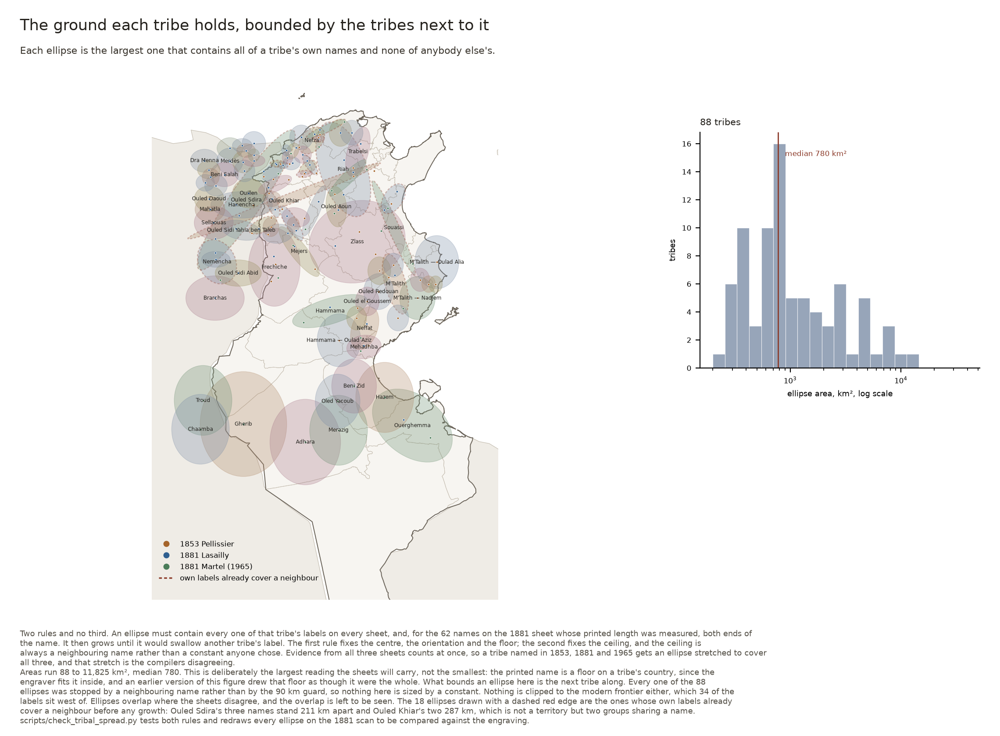
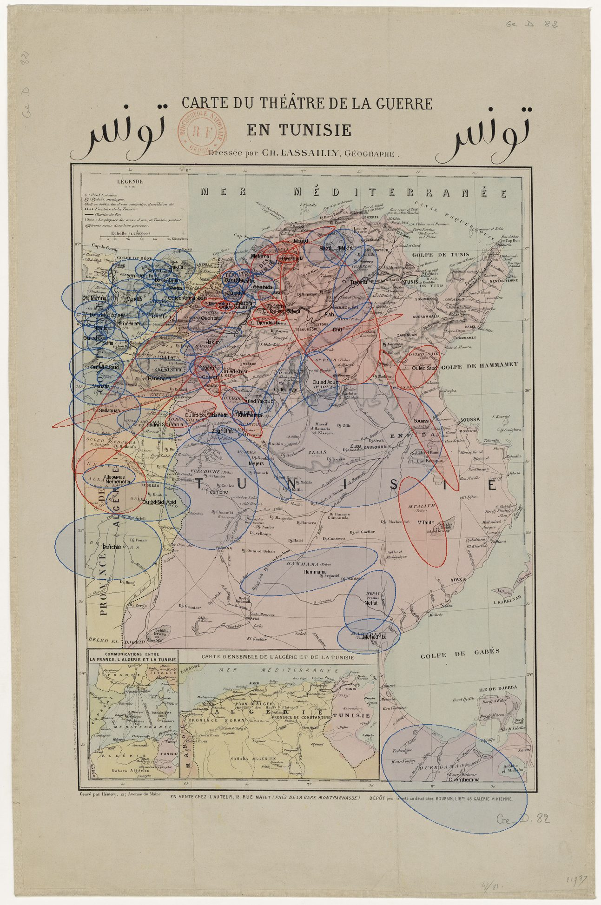

# Maps that annotate tribes

Which maps in this collection say where a tribe is, how each one says it, and where the named tribes sit on the ground.

| | |
| --- | --- |
| Coding, every record | [`data/gallica_tunisia_maps_tribes.csv`](../data/gallica_tunisia_maps_tribes.csv) |
| Variable definitions | [`docs/CODEBOOK-TRIBES.md`](CODEBOOK-TRIBES.md) |
| What was seen on each map | [`config/inspected_tribal_maps.json`](../config/inspected_tribal_maps.json) |
| Vocabulary and tribe gazetteer | [`config/tribal_gazetteer.json`](../config/tribal_gazetteer.json) |
| Labels transcribed, with pixels | [`config/tribal_labels_read.json`](../config/tribal_labels_read.json) |
| Labels placed on the ground | [`data/tribal_territories.csv`](../data/tribal_territories.csv), [`.geojson`](../data/tribal_territories.geojson) |
| Transform and residuals | [`data/tribal_fit.json`](../data/tribal_fit.json) |
| Do two sheets agree? | [`data/tribal_map_agreement.csv`](../data/tribal_map_agreement.csv) |
| How much ground a name covers | [`data/tribal_spread.csv`](../data/tribal_spread.csv) |
| Tribes on today's imadas | [`data/tribal_imada_assignment.csv`](../data/tribal_imada_assignment.csv) |
| Martel's 1881 sketch map, read | [`data/martel_1965_tribes.csv`](../data/martel_1965_tribes.csv) |
| How many people was a tribe? | [`docs/POPULATION-SOURCES.md`](POPULATION-SOURCES.md) |

## The catalogue does not know

Across 663 records — their Dublin Core, the BnF catalogue notices behind them and the partner libraries' own item pages — the word *tribu* occurs **zero** times. A gazetteer of 86 tribe names, every one of them read off a map in this collection, matches **3** records:

| Record | Year | What matched | Is it a tribal map? |
| --- | --- | --- | --- |
| [Carte du Voltaire. Expédition contre les Kroumirs](https://gallica.bnf.fr/ark:/12148/btv1b84446578) | — | Kroumirs | Yes — the Kroumir expedition of 1881 |
| [Tunisie Flle. N° XXXVIII-B5-C32, Ouargha / dessiné, héliog](https://1886.u-bordeaux-montaigne.fr/s/1886/item/340434) | — | Ouargha | No — a 1:50 000 sheet titled after the Ouargha district |
| [Tunisie Flle. N° X-B1-C33, Nefza / dressé, héliogravé et p](https://1886.u-bordeaux-montaigne.fr/s/1886/item/340374) | 1922 | Nefza | No — a 1:50 000 sheet titled after the Nefza district |

The generic vocabulary does no better. Tribe, fraction, nomade, douar, caidat, ethnographique and the rest match 4 records between them, and 3 of those match only on the weak colonial nouns — *indigènes*, *population*, *race* — which fire on a tuberculosis dispensary map of Paris as readily as on anything Tunisian. One record matches on strong terms: *Habitation rurale des indigènes*, which is genuinely an ethnographic map, and which says so only because its title is its subject.

So the count of maps that annotate tribes cannot be got from the metadata at any threshold. It has to be got by looking, and looking does not scale: **16 maps** have been read directly, of which **14** carry tribal annotation of some kind. Everything else in the collection is coded `unknown`, and `unknown` here means unknown, not no.

## What the annotation looks like, and how it changed

**A tribe is never drawn as a polygon.** Not once, on any sheet read for this coding. What the maps print is a *name in letterspaced capitals laid across the country the tribe holds*, and where the name stops the annotation stops. Whoever engraved these knew roughly where a tribe was and did not pretend to know where it ended — which is a more honest map of a pastoral society than a boundary would have been, and a harder one to turn into data.

What does get a boundary is the caïdat. From 1889 the Service géographique draws dotted limits around units named for the tribes — and that is the whole administrative story in one typographic difference: a tribe is a name without edges, a caïdat is a name with them.

Read in date order, the inspected maps show the grain of the annotation changing while the ground stays the same:

| Year | Map | Form | What it prints |
| --- | --- | --- | --- |
| 1842 | Carte de la Régence de Tunis dressée au Dépôt généra | `territory_label`, `lineage_toponym` | Dakhela; Ouled Zemlass (reading uncertain); Beni Khiar |
| 1853 | Carte de la Régence de Tunis / par E. Pellissier | `territory_label`, `lineage_toponym` | Madjer; Hamema; Frachiche Ouled Ali |
| 1857 | Carte de la régence de Tunis, dressée au Dépôt de la | `territory_label`, `douar_toponym`, `lineage_toponym` | Ouled Trabersi; Ouled Riahh; Ouled Arfa |
| 1881 | Carte de la Régence de Tunis (Garnier Frères) | `territory_label`, `douar_toponym`, `lineage_toponym` | Ouled Trabersi; Ouled Riahh; Ouled Arfa |
| 1881 | Carte du théâtre de la guerre en Tunisie / dressée p | `marked_tribe`, `territory_label` | 69 labels, transcribed |
| 1881 | Etude sur la frontière de la Tunisie / par le généra | *none seen* |  |
| 1881 | Carte du Voltaire. Expédition contre les Kroumirs | `territory_label`, `glossary`, `lineage_toponym` | Pays des Kroumirs; Ouled Trabersi; Ouled Menrha (reading uncertain) |
| 1886 | Carte des itinéraires de la Tunisie, 1:800 000 | *none seen* |  |
| 1889 | Carte de la Tunisie, dressée au service géographique | `caidat_label`, `admin_limit`, `lineage_toponym` | Kt des Riah; Kt des Ouled Yahia; Kt des Ouled Khalifa |
| 1900 | Carte routière de la Tunisie / Touring Club de Franc | `territory_label`, `smala`, `admin_limit` | M'Talith; Souassi (Smala des Souassi); Beni Khraltoun |
| 1911 | Environs de Medenine / Service géographique de l'Arm | `territory_label`, `lineage_toponym` | a letterspaced capital label cut by the window edge, reading ...A T |
| 1920 | Nouvelle carte de la Tunisie (Taride) | `territory_label`, `smala`, `lineage_toponym` | Souassi; Metellith; Neffet |
| 1930 | Habitation rurale des indigènes (Atlas d'Algérie et  | `thematic_distribution`, `admin_limit` |  |
| 1943 | Tunisie au 500.000e / Service géographique de l'armé | `caidat_label`, `admin_limit`, `lineage_toponym` | Caïdat de Souk el Khemis; Caïdat de Teboursouk; Caïdat de Medjez el Bab |
| — | Tunisie Flle. Pichon, 1:50 000 | `douar_toponym`, `lineage_toponym` |  |
| — | Tunisie Flle. Chorbane, 1:50 000 | `douar_toponym`, `lineage_toponym` |  |

Four stages, and the third is the one worth pausing on.

**1842–1881, the tribe as a country.** Pellissier in 1853 and the Dépôt de la guerre in 1857 spread tribe names across the steppe in capitals — MADJER, HAMEMA, OULED TRABERSI — and the 1857 sheet goes further, printing DOUARS OULED ARFA as a label in its own right: the tribe located through its camps. These are reconnaissance maps of a country France did not yet hold, and on them the tribe is the unit that matters, because the tribe is who a column would meet.

**1881, the tribe marked explicitly.** The invasion year produces the one sheet in the collection that tags its tribes: Lasailly's *Carte du théâtre de la guerre en Tunisie* prints `(Tribu)` under the name. It is transcribed in full below.

**1889, the tribe becomes the caïdat — and acquires an edge.** The Service géographique's 1:800 000, eight years into the protectorate, tiles the whole country with `Kt des X`: *caïdat des Riah*, *des Ouled Yahia*, *des Ouled Khalifa*, *des Neffet*, *des Aguerba*, *des Acara*, and — the label that settles what the abbreviation means — *Kt des Arrouch en Sendjac*, `arch` being the Arabic for tribe. Most caïdats are still named for the tribe they were built on, so the names survive; what changes is that they are now the names of administrative units, and the sheet draws their limits as dotted lines. Nobody ever drew a limit around a tribe.

*(An earlier reading of this sheet took `Kt` for `Ksour` — the tribe named through its granaries. It is recorded because it was a tidy story and it was wrong. Three things break it: the labels tile the Tell as well as the south, one of them is `Kt de Sfax`, which has no ksour, and one is `Kt des Arrouch`.)*

**1900–1943, the name detaches from the people.** Commercial sheets keep the tribes: the Touring Club map of 1900 and the Taride of 1920 both still print Souassi, Metellith, Neffet, though the Touring Club sets them so widely that a letter can stand 8 km from its neighbour while the administrative limits are inked more strongly than the names. The military sheets do not. By 1943 the Service géographique's 1:500 000 prints CAÏDAT DE TEBOURSOUK, CAÏDAT DE SOUK EL KHEMIS across the same Tell in the same letterspaced capitals — same unit as 1889, and now named for the market town rather than for the people. Fifty-four years to go from *caïdat des Riah* to *caïdat de Teboursouk*.

**And at 1:50 000, none of the above.** The large-scale series never names a tribe. It names the grain below: `Dr en Nouilia`, `Dr Krelifa b. Slimane` — the douar as a mapped settlement — and `Hr Ouled el Hadj`, `Bir Oulad Achour`. On the Chorbane sheet, which sits inside the country the 1881 and 1920 maps both label Souassi, the word Souassi does not appear. The tribe is present as its lineages and absent as itself, because at 1:50 000 a tribe is bigger than the sheet.

One map does something else entirely. *Habitation rurale des indigènes* (1930), a plate from the Atlas d'Algérie et de Tunisie, maps six classes of dwelling as coloured areas — tentes, gourbis, maisons à terrasse, maisons à toit de tuiles, maisons à l'européenne, grottes et ghorfas. It is the only thematic ethnographic map in the collection, and the only one that treats the distribution itself as the subject rather than as annotation.

## Two sheets, transcribed

Two of the inspected maps were read label by label and every tribe name given a coordinate: the 1881 Lasailly war-theatre sheet, because it marks its tribes with `(Tribu)` and so needs no judgement, and the 1853 Pellissier, because it is the densest tribal annotation in the collection and the earliest that is systematic. 114 labels in total, 83 of them inside modern Tunisia.

**The two transcriptions do not cover the same ground.** The 1881 face was read whole, in 20 tiles. The 1853 was read over the Tell, the Kroumirie, the steppe and the Sahel down to about latitude 34 — the country the other sheet also labels — and the Jerid, the Nefzaoua and the Dahar were left unread, the Ouerghemma among them. So the label counts below are not a measure of how much each sheet annotates, and differencing them as coverage would be differencing my reading, not the maps.

| Sheet | Labels | Marked `(Tribu)` | Control towns | In-sample RMS | Leave-one-out RMS |
| --- | --- | --- | --- | --- | --- |
| 1853 Carte de la Régence de Tunis / par E. Pellis | 45 | 0 | 10 | 84.7 px (5.8 km) | 119.4 px (8.17 km) |
| 1881 Carte du théâtre de la guerre en Tunisie / d | 69 | 40 | 7 | 39.6 px (3.16 km) | 77.3 px (6.17 km) |

**How accurate is a point?** Two questions, and the smaller answer is the one people would misuse.

Each transform is an affine fitted to towns whose modern coordinates are known, read off the sheet the same way the labels were. Leave-one-out RMS — the figure that applies to a label the fit never saw — is 6.17 km for 1881 and 8.17 km for 1853. Each contains the compilation's own error and the error in reading a printed dot, and does not separate them. The 1853 sheet is drawn at 1:800 000 against the 1881 sheet's 1:1 200 000 and is nonetheless the less accurate of the two, which is what twenty-eight years of survey between them buys.

Neither used the printed graticule, though both have one. On the 1881 sheet the scan carries a slight rotation and the frame is not square — the 8° tick on the top border and the 8° tick on the bottom border are 141 px apart in x — so a transform fitted to the border inherits the frame's skew. Towns do not have that problem.

Where a town could *not* be found is a measurement too. On the 1853 sheet neither Gafsa nor Tozeur is within 300 px of where a fit on the other ten towns predicts it. The south-west is the part Pellissier had least survey for, and that is what the failure says.

**The larger error is not positional at all.** Every name on the 1881 sheet has now been measured end to end: 62 of the 69 run **5.7 to 48.1 km of ground, median 16**, NEFZA the shortest and HANENCHAS the longest, in [`data/tribal_spread.csv`](../data/tribal_spread.csv). An earlier figure of 14 to 32 km, quoted in this report and in the codebook, came from a sample of six and missed both ends. The point records where the name is *centred*, so it locates the tribe to within a tribe's width and no finer. On the 1881 sheet, reading the same label twice from two overlapping tiles agreed to 3–5 px and the two towns read twice agreed to 3 px. On the 1853 sheet the same check gives 80 px for HAMEMA, and MADJER — which runs along an arc of some 1500 px from Sbiba round to Djilma — had its letters read at three points 1000 px apart before they resolved into one name. A `(Tribu)` tag tells you where a label ends. Without one, nothing does.

### Do the two sheets agree?

This is the only external check available on either transcription. There is no ground truth for where a tribe was, but two compilers working twenty-eight years apart, one before the conquest and one during it, are independent. **30 tribes are named on both sheets**, and the distance between the two placements has a median of **23.0 km** — about one label length. 7 agree to within 10 km, 12 to within 20 km. Full table in [`data/tribal_map_agreement.csv`](../data/tribal_map_agreement.csv).

| Tribe | 1853 prints | 1881 prints | Apart |
| --- | --- | --- | --- |
| Ghezoran | Grezouani | Ghezoran | 4.3 km |
| Drid | Drid et autres Arabes melés | Drid | 5.8 km |
| Mehadhba | Mahedeba | Mahadeba | 6.5 km |
| Mogod | El Mogod | El Mogod | 6.7 km |
| Djendouba | Djendouba | Djendouba | 6.8 km |
| Meressen | Merassen | Meressen | 7.0 km |
| … | | | |
| Mejers | Madjer | Mejers | 43.8 km |
| Riah | Riah | Riah | 46.8 km |
| Ouled Khiar | Oulad Khiar | Ouled Khiar | 197.3 km |

The outlier is the finding. **Ouled Khiar sits 197 km apart** because the two sheets are not naming the same people: Pellissier's Oulad Khiar is east of Tunis below Zaghouan, and Lasailly's is in the Constantine province west of the frontier. Two groups, one name, and a gazetteer that matches on names merges them. It is left merged in the data, flagged here, because splitting it would be a claim about the tribes rather than about the maps. Riah, at 47 km, may be the same case: the 1853 sheet prints it in the Mogods behind Bizerte and the 1881 sheet by Medjez el Bab. Mejers, at 44 km, is not — it is the MADJER arc, and the gap is the width of my uncertainty about where that label is centred, not a disagreement between the sheets.

### Where the 1881 labels fall

By modern gouvernorat, for the sheet whose face was read in full:

| Gouvernorat | Labels |
| --- | --- |
| Jendouba | 10 |
| Béja | 7 |
| Le Kef | 5 |
| Bizerte | 3 |
| Kassérine | 3 |
| Siliana | 3 |
| Kairouan | 2 |
| Sfax | 2 |
| Manubah | 1 |
| Sousse | 1 |
| Mahdia | 1 |
| Sidi Bou Zid | 1 |
| Médenine | 1 |
| *west of the frontier* | 29 |

The north-west carries the annotation and the south barely does. Jendouba, Béja and Le Kef hold 22 of the 40 Tunisian labels between them, while south of Sfax the entire country — the Jerid, the Nefzaoua, the Dahar, the Matmata — carries exactly one, the Ouerghemma. That is not a map of where tribes were. It is a map of where a French compiler in 1881 had names for them, and 1881 is the year of the Kroumir campaign in exactly that north-western corner. Over the same latitudes the 1853 sheet is less lopsided — its median label sits at 35.9°N against the 1881 sheet's 36.6°N, and seven of its labels fall south of 35°N against four — though part of that is simply that Pellissier names the fractions of the M'Talith and the Hamema where Lasailly names the parent.

## The ground each tribe holds

A tribe on these sheets is a name letterspaced across its country with no line around it. Four ways of drawing that have been tried here and the first three are kept because each failed differently.

| Drawn as | What went wrong |
| --- | --- |
| A dot per label | Exact, and silent about extent. |
| Administrative units, filled or sprinkled | Invents the extent, and confines a nineteenth-century tribe inside a 2022 mesh. |
| A Gaussian blur of the labels | Looks measured and is not: the bandwidth is a choice, so every tribe comes out the same size whatever the sheet says. |
| A circle the length of the printed name | Honest and far too small. The engraver fits the name inside the country, usually well inside, so the length is a floor on the territory and not the territory. |

**What is drawn now is the largest ellipse each tribe can have before it reaches another tribe's name.** Two rules and no third:

1. It must contain all of that tribe's own evidence: every label centre on every sheet, and both ends of the name for the 62 on the 1881 sheet whose printed length was measured.
2. It must contain no other tribe's label.

The first rule fixes the centre, the orientation and the floor. The second fixes the ceiling, and the ceiling is a neighbouring name rather than a constant anyone chose: **all 88 ellipses were stopped by a neighbour**, none by the 90 km guard the script carries against a lone label in an empty quarter. `stopped_by` in the table names the tribe that did it.

Evidence from all three sheets counts at once, so a tribe named by Pellissier in 1853, by Lasailly in 1881 and by Martel in 1965 gets an ellipse stretched to cover all three, and that stretch is the compilers disagreeing. 35 of 88 tribes are named on more than one sheet.

| | |
| --- | --- |
| Smallest | 88 km² |
| Median | 780 km² |
| Largest | 11,825 km² |
| Gherib | 123 × 123 km, 11,825 km², stopped by the Chaamba |
| Zlass | 137 × 96 km, 10,285 km², stopped by the Ouled Aoun |
| Adhara | 100 × 100 km, 7,877 km², stopped by the Merazig |
| Ouerghemma | 121 × 74 km, 7,054 km², stopped by the Hazem |

**This is deliberately the largest reading the sheets will carry.** Nothing is clipped to the modern frontier, which 34 of the 141 labels sit west of. Ellipses overlap where the sheets disagree or where tribes interleaved, and the overlap is left to be seen rather than resolved, because no sheet in this collection says where one tribe stopped and the next began.

Per-tribe results are in [`data/tribal_spread.csv`](../data/tribal_spread.csv), with the axes, the area, how far the ellipse grew and what stopped it.

### Checking them against the sheets

An ellipse drawn over a modern basemap is easy to believe and hard to check, so [`check_tribal_spread.py`](../scripts/check_tribal_spread.py) inverts each sheet's own affine and draws every ellipse back onto the scan in that sheet's pixels. The inverse reproduces the control towns to 38.6 px on the 1881 sheet and 70.8 px on the 1853, about 3 and 5 km, so the overlay is testing the ellipses and not the transform.

Held against the engraving, the ellipses sit on their names. The Hammama ellipse lies along *HAMMAMA (Tribu)* across the steppe, the Zlass over *ZLAAS* and the Kairouan country, the Frechiche over *FRÉCHICHE (Tribu)* at Kasserine, the Ouerghemma over *OUERGAMA* in the south-east. The same holds on the 1853 sheet, where the Zlass ellipse covers both *DJELAS OU KOUAIB* and *DJELAS SERRASSIN* and the Mejers ellipse follows the *MADJER* arc. Four crops per sheet at full resolution are in [`tribal_spread_spot_1881.jpg`](img/tribal_spread_spot_1881.jpg) and [`tribal_spread_spot_1853.jpg`](img/tribal_spread_spot_1853.jpg).

The two rules are tested rather than trusted. **Rule 1 holds for all 88**: no tribe has a label outside its own ellipse. Rule 2 fails 45 times across 18 tribes, and those failures are the useful part.

**A tribe whose own ellipse swallows a neighbour is a tribe whose compilers disagreed about where it was.** The ellipse has to contain all its own labels, so if two sheets put the name 200 km apart it cannot avoid covering whatever lies between. Read the top of this list as suspected name collisions rather than as territories:

| Tribe | Labels | Sheets | Own labels span | Covers |
| --- | --- | --- | --- | --- |
| Ouled Khiar | 2 | 2 | 287 km | Drid, Sellaouas |
| Ouled Sdira | 3 | 2 | 211 km | Beni Mtir, Charen, Ghezoran, Hakim, Hanencha, Kroumirs, Me |
| Souassi | 2 | 2 | 126 km | Ouled Saïd |
| Riah | 4 | 3 | 119 km | Djeladjela, Drid, Nefza, Ouled Aoun, Trabelsi |
| M'Talith | 3 | 3 | 74 km | Oulad Amer |
| Mogod | 3 | 3 | 59 km | Nefza |

**The spot check settles what the flag is for.** Souassi's ellipse is a 126 by 16 km splinter running from Enfida down past Sousse, because Lasailly prints SOUASSI by Enfida while Pellissier and Martel put it in the Sahel. That is two placements joined by a line, not a territory, and no reader should take it for one.

**And it found a gap in the transcription.** The 1853 sheet prints *FRACHICHE MÉRIDIONALE* as well as *FRACHICHE OULAD ALI* and *FRACHICHE OUAZAZ*, and only the last two were transcribed, so the Frechiche ellipse stops short of the ground that sheet gives the tribe, out towards Tebessa. Recorded in [`data/tribal_spread_check.json`](../data/tribal_spread_check.json) as a known gap rather than patched with a coordinate nobody read.

Ouled Khiar was already known to be two groups sharing a name, 197 km apart on the two Gallica sheets and 287 km once Martel's placement joins them. **Ouled Sdira at 211 km is the new one**, and Souassi at 126 km and Riah at 119 km are the next candidates. None of them is split in the gazetteer, because splitting would be a claim about the tribes rather than about the maps; they are flagged instead, drawn dashed on the figure and counted in `encloses_other_tribes`.

## Coding

| `tribal_annotation` | n | Meaning |
| --- | --- | --- |
| `unknown` | 645 | nobody has looked |
| `observed` | 14 | read on the scan; `annotation_forms` says what |
| `none_seen` | 2 | the scan was read in the recorded windows and carried none |
| `catalogued` | 2 | the record's own text uses tribal vocabulary; the face has not been read |

`expected_form` is the one inferred column, and it is deliberately kept out of `tribal_annotation`. It says what a map of that scale band and period *would* be expected to carry, calibrated on the inspected sixteen. The 1886 *Carte des itinéraires* is why it stays an expectation: 1:800 000, the right decade, the Service géographique's own press, and no tribal annotation in the window read — it prints wells instead, each graded for water quality, because an itinerary map answers a marching column's question and the column's question was water.

## What this does not settle

**Sixteen maps out of 663.** The inspected set was chosen for the highest prior — medium-scale French maps of the Regency between 1840 and 1950 — so the hit rate among them says nothing about the collection. The honest count is: 14 maps in this collection are known to annotate tribes, and an unknown number of the rest do.

**Two maps transcribed, and one of them by judgement.** The 1853 Pellissier marks nothing: every label from it was classed as a tribe by eye, against a gazetteer built partly from that same reading, which is a shorter loop than anyone would like. Labels that could be villages — Oulad Amer, Oulad Khalifa, Taïfa — are held at medium confidence and flagged in the data. The 1881 sheet needs none of that, and is why it is the reference.

**A point is not a territory.** Nothing in `data/tribal_territories.csv` should be joined to a modern boundary and reported as a tribe's extent. The gouvernorat column exists to make the points findable, not to assign a tribe to a governorate.

**The spellings are French.** Frechiche, Fraichiche, Frechich; Kroumir, Khroumir, Krumir; Ouled, Oulad, O., Od. The gazetteer normalises what it has seen, and a tribe printed in a spelling nobody has read yet will not match.

