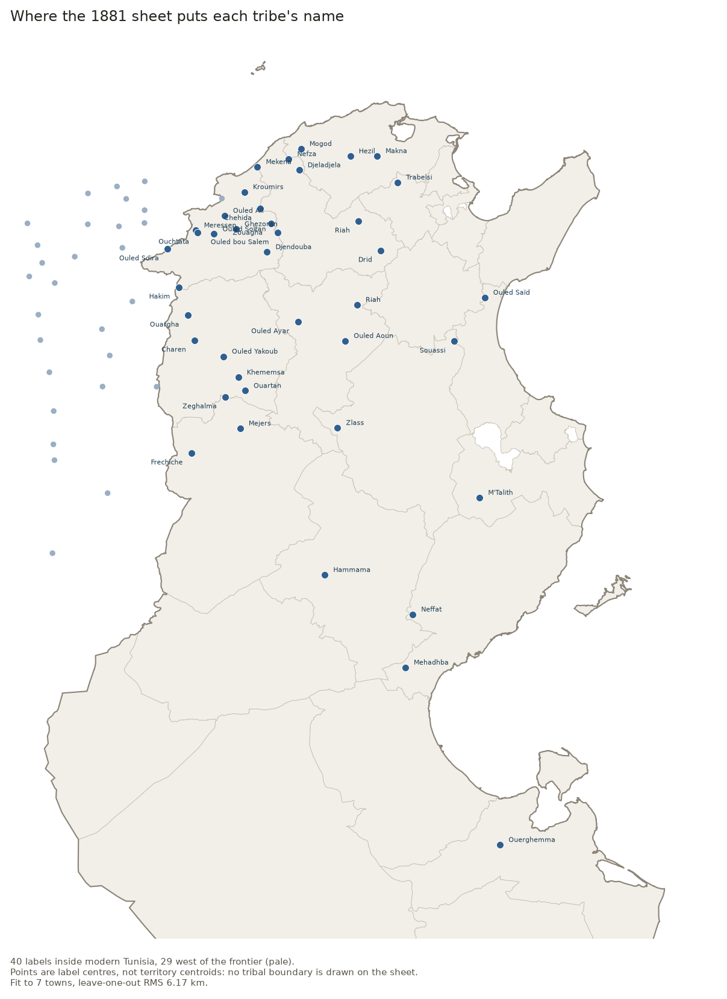

# Maps that annotate tribes

Which maps in this collection say where a tribe is, how each one says it, and where the named tribes sit on the ground.

| | |
| --- | --- |
| Coding, every record | [`data/gallica_tunisia_maps_tribes.csv`](../data/gallica_tunisia_maps_tribes.csv) |
| Variable definitions | [`docs/CODEBOOK-TRIBES.md`](CODEBOOK-TRIBES.md) |
| What was seen on each map | [`config/inspected_tribal_maps.json`](../config/inspected_tribal_maps.json) |
| Vocabulary and tribe gazetteer | [`config/tribal_gazetteer.json`](../config/tribal_gazetteer.json) |
| Labels transcribed, with pixels | [`config/tribal_labels_read.json`](../config/tribal_labels_read.json) |
| Labels placed on the ground | [`data/tribal_territories.csv`](../data/tribal_territories.csv), [`.geojson`](../data/tribal_territories.geojson) |
| Transform and residuals | [`data/tribal_fit.json`](../data/tribal_fit.json) |

## The catalogue does not know

Across 663 records — their Dublin Core, the BnF catalogue notices behind them and the partner libraries' own item pages — the word *tribu* occurs **zero** times. A gazetteer of 75 tribe names, every one of them read off a map in this collection, matches **3** records:

| Record | Year | What matched | Is it a tribal map? |
| --- | --- | --- | --- |
| [Carte du Voltaire. Expédition contre les Kroumirs](https://gallica.bnf.fr/ark:/12148/btv1b84446578) | — | Kroumirs | Yes — the Kroumir expedition of 1881 |
| [Tunisie Flle. N° XXXVIII-B5-C32, Ouargha / dessiné, héliog](https://1886.u-bordeaux-montaigne.fr/s/1886/item/340434) | — | Ouargha | No — a 1:50 000 sheet titled after the Ouargha district |
| [Tunisie Flle. N° X-B1-C33, Nefza / dressé, héliogravé et p](https://1886.u-bordeaux-montaigne.fr/s/1886/item/340374) | 1922 | Nefza | No — a 1:50 000 sheet titled after the Nefza district |

The generic vocabulary does no better. Tribe, fraction, nomade, douar, caidat, ethnographique and the rest match 4 records between them, and 3 of those match only on the weak colonial nouns — *indigènes*, *population*, *race* — which fire on a tuberculosis dispensary map of Paris as readily as on anything Tunisian. One record matches on strong terms: *Habitation rurale des indigènes*, which is genuinely an ethnographic map, and which says so only because its title is its subject.

So the count of maps that annotate tribes cannot be got from the metadata at any threshold. It has to be got by looking, and looking does not scale: **16 maps** have been read directly, of which **14** carry tribal annotation of some kind. Everything else in the collection is coded `unknown`, and `unknown` here means unknown, not no.

## What the annotation looks like, and how it changed

A tribe is never drawn as a polygon. Not once, on any sheet read for this coding. What the maps print is a **name in letterspaced capitals laid across the country the tribe holds**, and where the name stops the annotation stops. Whoever engraved these knew roughly where a tribe was and did not pretend to know where it ended — which is a more honest map of a pastoral society than a boundary would have been, and a harder one to turn into data.

Read in date order, the inspected maps show the grain of the annotation changing while the ground stays the same:

| Year | Map | Form | What it prints |
| --- | --- | --- | --- |
| 1842 | Carte de la Régence de Tunis dressée au Dépôt généra | `territory_label`, `lineage_toponym` | Dakhela; Ouled Zemlass (reading uncertain); Beni Khiar |
| 1853 | Carte de la Régence de Tunis / par E. Pellissier | `territory_label`, `lineage_toponym` | Madjer; Oulad; Hamema |
| 1857 | Carte de la régence de Tunis, dressée au Dépôt de la | `territory_label`, `douar_toponym`, `lineage_toponym` | Ouled Trabersi; Ouled Riahh; Ouled Arfa |
| 1881 | Carte de la Régence de Tunis (Garnier Frères) | `territory_label`, `douar_toponym`, `lineage_toponym` | Ouled Trabersi; Ouled Riahh; Ouled Arfa |
| 1881 | Carte du théâtre de la guerre en Tunisie / dressée p | `marked_tribe`, `territory_label` | 69 labels, transcribed |
| 1881 | Etude sur la frontière de la Tunisie / par le généra | *none seen* |  |
| 1881 | Carte du Voltaire. Expédition contre les Kroumirs | `territory_label`, `glossary`, `lineage_toponym` | Pays des Kroumirs; Ouled Trabersi; Ouled Menrha (reading uncertain) |
| 1886 | Carte des itinéraires de la Tunisie, 1:800 000 | *none seen* |  |
| 1889 | Carte de la Tunisie, dressée au service géographique | `tribal_ksour`, `lineage_toponym` | Kt des Neffet; Kt des Aguerba; Kt des Mahedba |
| 1900 | Carte routière de la Tunisie / Touring Club de Franc | `territory_label`, `smala`, `admin_limit` | M'Talith; Souassi (Smala des Souassi); Beni Khraltoun |
| 1911 | Environs de Medenine / Service géographique de l'Arm | `territory_label`, `lineage_toponym` | a letterspaced capital label cut by the window edge, reading ...A T |
| 1920 | Nouvelle carte de la Tunisie (Taride) | `territory_label`, `smala`, `lineage_toponym` | Souassi; Metellith; Neffet |
| 1930 | Habitation rurale des indigènes (Atlas d'Algérie et  | `thematic_distribution`, `admin_limit` |  |
| 1943 | Tunisie au 500.000e / Service géographique de l'armé | `caidat_label`, `admin_limit`, `lineage_toponym` | Caïdat de Souk el Khemis; Caïdat de Teboursouk; Caïdat de Medjez el Bab |
| — | Tunisie Flle. Pichon, 1:50 000 | `douar_toponym`, `lineage_toponym` |  |
| — | Tunisie Flle. Chorbane, 1:50 000 | `douar_toponym`, `lineage_toponym` |  |

Four stages, and the third is the one worth pausing on.

**1842–1881, the tribe as a country.** Pellissier in 1853 and the Dépôt de la guerre in 1857 spread tribe names across the steppe in capitals — MADJER, HAMEMA, OULED TRABERSI — and the 1857 sheet goes further, printing DOUARS OULED ARFA as a label in its own right: the tribe located through its camps. These are reconnaissance maps of a country France did not yet hold, and on them the tribe is the unit that matters, because the tribe is who a column would meet.

**1881, the tribe marked explicitly.** The invasion year produces the one sheet in the collection that tags its tribes: Lasailly's *Carte du théâtre de la guerre en Tunisie* prints `(Tribu)` under the name. It is transcribed in full below.

**1889, the tribe as its granaries.** The Service géographique's 1:800 000 names the southern tribes not by their grazing but by their ksour — `Kt des Neffet`, `Kt des Aguerba`, `Kt des Mahedba`, `Kt des Acara`. Same tribes as the Taride map thirty years later; a different thing pointed at. A ksar is a building with coordinates. Grazing is not.

**1900–1943, the tribe becomes the caidat.** The Touring Club sheet of 1900 still prints the names but sets them so widely that a letter can stand 8 km from its neighbour, while the administrative limits are inked more strongly than the names. By 1943 the Service géographique's 1:500 000 prints CAÏDAT DE TEBOURSOUK, CAÏDAT DE SOUK EL KHEMIS across the same Tell in the same letterspaced capitals — the annotation survives, the tribe is replaced by the unit the protectorate built on it, and most of those units are named for a market town rather than for a people.

**And at 1:50 000, none of the above.** The large-scale series never names a tribe. It names the grain below: `Dr en Nouilia`, `Dr Krelifa b. Slimane` — the douar as a mapped settlement — and `Hr Ouled el Hadj`, `Bir Oulad Achour`. On the Chorbane sheet, which sits inside the country the 1881 and 1920 maps both label Souassi, the word Souassi does not appear. The tribe is present as its lineages and absent as itself, because at 1:50 000 a tribe is bigger than the sheet.

One map does something else entirely. *Habitation rurale des indigènes* (1930), a plate from the Atlas d'Algérie et de Tunisie, maps six classes of dwelling as coloured areas — tentes, gourbis, maisons à terrasse, maisons à toit de tuiles, maisons à l'européenne, grottes et ghorfas. It is the only thematic ethnographic map in the collection, and the only one that treats the distribution itself as the subject rather than as annotation.

## The 1881 sheet, transcribed

69 labels were read off the face of [Lasailly's 1881 war-theatre map](https://gallica.bnf.fr/ark:/12148/btv1b84389986) — the whole map face in 20 overlapping tiles at full scan resolution — and each was given a coordinate. 40 of them carry an explicit `(Tribu)`-family marker and 29 do not; 40 fall inside modern Tunisia and 29 west of the frontier, in what the sheet labels the Province de Constantine. The two groups nearly coincide — the engraver marked the tribes inside the Regency and left the Constantine ones as bare capitals — but not quite: Mogod and Charen sit inside Tunisia unmarked, and two marked tribes, the Beni Mtir and the Ouled bou Ghanem, fall just west of a frontier that in 1881 was still being argued over, as General Lewal's *Etude sur la frontière de la Tunisie* in this same collection attests.

**How accurate is a point?** Two different questions, and both answers are small compared with a tribe.

The transform is an affine fitted to 7 towns whose modern coordinates are known — Tunis, Bizerte, Le Kef, Kairouan, Sousse, Sfax, Gafsa — read off the sheet the same way the labels were. In-sample RMS is **39.6 px (3.16 km)**; leave-one-out, which is the honest number for a label the fit never saw, is **77.3 px (6.17 km)**. That figure is the 1881 compilation's own error plus mine, and it is not separable into the two.

The graticule was not used, though it is printed and legible, and the reason is worth recording: the sheet is scanned with a slight rotation and its frame is not square — the 8° tick on the top border and the 8° tick on the bottom border are 141 px apart in x. A transform fitted to the border inherits the frame's skew. Towns do not have that problem.

**The larger error is not positional at all.** Six labels measured across the tiles run 175 to 400 px — ZLAAS the shortest, OUERGAMA the longest — which at this sheet's scale is **14 to 32 km of ground**. The point records where the name is *centred*, so it locates the tribe to within a tribe's width and no finer. Reading the same label twice from two overlapping tiles agreed to 3–5 px, and the two towns read twice agreed to 3 px, so transcription is not the limit. The annotation is.

Where the named tribes fall, by modern gouvernorat:

| Gouvernorat | Labels |
| --- | --- |
| Jendouba | 10 |
| Béja | 7 |
| Le Kef | 5 |
| Bizerte | 3 |
| Kassérine | 3 |
| Siliana | 3 |
| Kairouan | 2 |
| Sfax | 2 |
| Manubah | 1 |
| Sousse | 1 |
| Mahdia | 1 |
| Sidi Bou Zid | 1 |
| Médenine | 1 |
| *west of the frontier* | 29 |

The north-west carries the annotation and the south barely does. Jendouba, Béja and Le Kef hold 22 of the 40 Tunisian labels between them, while south of Sfax the entire country — the Jerid, the Nefzaoua, the Dahar, the Matmata — carries exactly one, the Ouerghemma. That is not a map of where tribes were. It is a map of where a French compiler in 1881 had names for them, and 1881 is the year of the Kroumir campaign in exactly that north-western corner.

## Coding

| `tribal_annotation` | n | Meaning |
| --- | --- | --- |
| `unknown` | 645 | nobody has looked |
| `observed` | 14 | read on the scan; `annotation_forms` says what |
| `none_seen` | 2 | the scan was read in the recorded windows and carried none |
| `catalogued` | 2 | the record's own text uses tribal vocabulary; the face has not been read |

`expected_form` is the one inferred column, and it is deliberately kept out of `tribal_annotation`. It says what a map of that scale band and period *would* be expected to carry, calibrated on the inspected sixteen. The 1886 *Carte des itinéraires* is why it stays an expectation: 1:800 000, the right decade, the Service géographique's own press, and no tribal annotation in the window read — it prints wells instead, each graded for water quality, because an itinerary map answers a marching column's question and the column's question was water.

## What this does not settle

**Sixteen maps out of 663.** The inspected set was chosen for the highest prior — medium-scale French maps of the Regency between 1840 and 1950 — so the hit rate among them says nothing about the collection. The honest count is: 14 maps in this collection are known to annotate tribes, and an unknown number of the rest do.

**One map transcribed.** The 1853 Pellissier is denser in tribal names than the 1881 sheet and is not transcribed here, because it marks none of them and each would have to be classified by eye against a gazetteer rather than read off a tag. The comparison it would allow — the same country named twice, twenty-eight years and one conquest apart — is the obvious next piece of work.

**A point is not a territory.** Nothing in `data/tribal_territories.csv` should be joined to a modern boundary and reported as a tribe's extent. The gouvernorat column exists to make the points findable, not to assign a tribe to a governorate.

**The spellings are French.** Frechiche, Fraichiche, Frechich; Kroumir, Khroumir, Krumir; Ouled, Oulad, O., Od. The gazetteer normalises what it has seen, and a tribe printed in a spelling nobody has read yet will not match.

